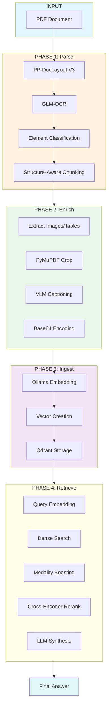

# Multimodal RAG

A structure-aware multimodal retrieval-augmented generation (RAG) pipeline that preserves document layout, tables, images, and formulas for improved retrieval quality over naive text extraction approaches.

## Overview

This project demonstrates how preserving document structure (element types, bounding boxes, reading order) dramatically improves retrieval quality compared to naive text chunking. The pipeline:

1. **Parses** PDFs with structure awareness (tables, images, formulas preserved)
2. **Enriches** with VLM-generated image captions
3. **Ingests** into a vector database (Qdrant)
4. **Retrieves** with modality boosting + cross-encoder reranking



---

## Features

### 1. Structure-Aware Parsing
- Uses **PP-DocLayout-V3** for layout detection (tables, figures, formulas, text)
- Uses **GLM-OCR** for text recognition within detected regions
- Preserves bounding boxes for spatial-aware retrieval

### 2. Multimodal Enrichment
- Extracts images/tables/formulas as base64-encoded images
- Generates descriptive captions via VLM (qwen2.5vl:7b)
- Stores both raw content and captions for semantic search

### 3. Modality Boosting
- Automatically detects visual queries (keywords: diagram, flowchart, figure, image...)
- Applies 35% score boost to image chunks for visual queries
- Ensures images rank #1 for diagram-related questions

### 4. Cross-Encoder Reranking
- Two-stage retrieval: dense search → cross-encoder reranking
- Uses ms-marco-MiniLM-L-12-v2 for relevance scoring
- Improves precision from top-20 to top-4
- **Note**: Skipped for visual queries (modality boosting alone works better)

### 5. Local-First Architecture
- All models run locally via Ollama
- No external API dependencies
- Qdrant for local vector storage

---

## Directory Structure

```
multimodal_rag/
├── input/                   # Input PDF files
│   └── test.pdf
├── results/                  # Parsed/enriched JSON + logs + evaluation outputs
├── tests/                   # Test & evaluation scripts
│   ├── run_test_queries.py
│   ├── evaluate_retrieval.py
│   └── evaluate_rerank_impact.py
├── src/                     # Main pipeline code
│   ├── config.yaml          # Configuration
│   ├── pyproject.toml      # Dependencies
│   ├── phase1_parse.py      # PDF parsing (PP-DocLayout + GLM-OCR)
│   ├── phase2_enrich.py    # VLM image captioning
│   ├── phase3_ingest.py     # Qdrant vector ingestion
│   ├── phase4_retrieve.py  # Retrieval + synthesis
│   ├── schemas.py          # Data models
│   └── chunker.py          # Chunking logic
├── qdrant_db/              # Local vector database
├── run_all.py             # Run full pipeline
├── README.md
├── workflow.md
└── .gitignore
```

---

## Installation & Setup

### Prerequisites

1. **Ollama** - Run `ollama serve` before starting
2. **uv** - Package manager (install via `pip install uv`)
3. **Python 3.12** - Required for cross-encoder support (numpy compatibility)

### Model Setup

```bash
# Pull required models
ollama pull qwen3-embedding:4b   # Embeddings
ollama pull qwen2.5vl:7b       # LLM + VLM
```

### Install Dependencies

```bash
# Install Python 3.12 via uv
uv python install 3.12

# Create virtual environment
rm -rf .venv
uv venv .venv --python 3.12

# Activate and install dependencies
source .venv/bin/activate
uv sync
```

---

## Usage

### Option 1: Run All-in-One Script (Recommended)

```bash
# Full pipeline + test queries
python run_all.py

# Just test queries (if data already exists)
python run_all.py --test-only

# Interactive retrieval mode
python src/phase4_retrieve.py
```

### Option 2: Run Individual Phases

```bash
# Phase 1: Parse PDF
python src/phase1_parse.py input/test.pdf

# Phase 2: Enrich
python src/phase2_enrich.py

# Phase 3: Ingest to Qdrant
python src/phase3_ingest.py

# Phase 4: Interactive Retrieval
python src/phase4_retrieve.py
```

---

## Configuration

All configuration is in `src/config.yaml`:

```yaml
models:
  embedding: "qwen3-embedding:4b"
  llm: "qwen2.5vl:7b"
  vlm: "qwen2.5vl:7b"
  cross_encoder: "cross-encoder/ms-marco-MiniLM-L-12-v2"

qdrant:
  path: "qdrant_db"

directories:
  input: "input"
  results: "results"
```

---

## Modality Boosting

Visual queries like "What does the architecture diagram show?" didn't retrieve image chunks because image captions use different vocabulary than the query. The solution is **query-time modality boosting**:

```python
visual_keywords = {"diagram", "flowchart", "figure", "image", 
                 "chart", "visual", "illustration", "picture",
                 "encoder", "decoder"}

if set(query.lower().split()) & visual_keywords:
    # 35% boost for image chunks
    for hit in results:
        if hit.payload.get("modality") == "image":
            hit.score *= 1.35
```

### Results

| Query | Before | After (Boosted) |
|-------|--------|----------------|
| "What does the architecture diagram show?" | IMAGE #7 (0.837) | **IMAGE #1 (1.133)** |
| "Describe encoder/decoder in flowchart" | IMAGE #12 (0.665) | **IMAGE #1 (0.897)** |

---

## Test Results

See `results/TEST_RESULTS.md` for detailed query results.

| Query Type | Top Result | Status |
|-----------|----------|--------|
| Table | TABLE at #1 | ✅ |
| Image | IMAGE at #1 (with boost) | ✅ |
| Text | TEXT at #1 | ✅ |

---

## Pipeline Details

For detailed workflow diagrams, see [workflow.md](workflow.md):

- Overall pipeline flow
- Phase 1-4 detailed diagrams
- Modality boosting logic flowchart
- Data schemas

---

## Troubleshooting

### Model Not Found

```bash
# Pull models first
ollama pull qwen3-embedding:4b
ollama pull qwen2.5vl:7b
```

### Qdrant Lock Error

```bash
# Delete lock file
rm qdrant_db/.lock
```

### Cross-Encoder Import Error

If you see numpy type errors, ensure you're using Python 3.12:
```bash
uv python install 3.12
uv venv .venv --python 3.12
source .venv/bin/activate
uv sync
```

---

## License

MIT License