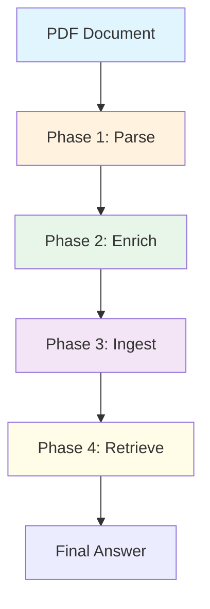

# Multimodal RAG Prototype

A structure-aware multimodal retrieval-augmented generation (RAG) pipeline that preserves document layout, tables, images, and formulas for improved retrieval quality over naive text extraction approaches.

## Overview

This prototype demonstrates how preserving document structure (element types, bounding boxes, reading order) dramatically improves retrieval quality compared to naive text chunking. The pipeline:

1. **Parses** PDFs with structure awareness (tables, images, formulas preserved)
2. **Enriches** with VLM-generated image captions
3. **Ingests** into a vector database (Qdrant)
4. **Retrieves** with modality boosting for visual queries



---

## Features

### 1. Structure-Aware Parsing
- Uses **PP-DocLayout-V3** for layout detection (tables, figures, formulas, text)
- Uses **GLM-OCR** for text recognition within detected regions
- Preserves bounding boxes for spatial-aware retrieval

### 2. Multimodal Enrichment
- Extracts images/tables/formulas as base64-encoded images
- Generates descriptive captions via VLM (qwen2.5vl:7b)
- Stores both raw content and captions for semantic search

### 3. Modality Boosting
- Automatically detects visual queries (keywords: diagram, flowchart, figure, image...)
- Applies 35% score boost to image chunks for visual queries
- Ensures images rank #1 for diagram-related questions

### 4. Cross-Encoder Reranking
- Two-stage retrieval: dense search → cross-encoder reranking
- Uses ms-marco-MiniLM-L-6-v2 for relevance scoring
- Improves precision from top-20 to top-4
- **Note**: Skipped for visual queries (modality boosting alone works better)

### 5. Local-First Architecture
- All models run locally via Ollama
- No external API dependencies
- Qdrant for local vector storage

---

## Architecture

### System Components

```
┌─────────────────────────────────────────────────────────────────┐
│                     MULTIMODAL RAG PIPELINE                        │
├─────────────────────────────────────────────────────────────────┤
│                                                                 │
│  ┌─────────────┐    ┌─────────────┐    ┌─────────────┐    ┌───────────┐ │
│  │   Phase   │    │   Phase   │    │   Phase   │    │  Phase   │ │
│  │    1     │───▶│    2      │───▶│    3      │───▶│    4     │ │
│  │  (Parse)  │    │ (Enrich)  │    │ (Ingest)  │    │(Retrieve)│ │
│  └─────────────┘    └─────────────┘    └─────────────┘    └───────────┘ │
│        │              │              │              │              │             │
│        ▼              ▼              ▼              ▼              ▼             │
│  ┌──────────┐  ┌──────────┐  ┌──────────┐  ┌──────────┐  ┌────────┐ │
│  │structured│  │ enriched│  │ Qdrant  │  │  Dense  │  │ Answer │ │
│  │ chunks  │  │ chunks  │  │  DB     │  │ Search  │  │       │ │
│  └────────┘  └──────────┘  └──────────┘  └──────────┘  └────────┘ │
│                                                                 │
├─────────────────────────────────────────────────────────────────┤
│                       MODELS                                     │
│  ┌──────────────┐ ┌────────────┐ ┌──────────┐ ┌──────────┐ │
│  │ Embedding    │ │    LLM    │ │   VLM    │ │Cross-Encd │ │
│  │qwen3-embed│ │qwen2.5vl │ │qwen2.5vl │ │ ms-marco │ │
│  │    :4b    │ │   :7b    │ │   :7b    │ │ MiniLM  │ │
│  └──────────────┘ └────────────┘ └──────────┘ └──────────┘ │
└─────────────────────────────────────────────────────────────────┘
```

### Data Flow

```
PDF Input
    │
    ├── Phase 1: Parse
    │   ├── Naive: fitz.extract_text() → flat chunks (lost: structure)
    │   └── Structure-Aware: PP-DocLayout + GLM-OCR → structured chunks
    │       ├── Image: modality=image, bbox preserved
    │       ├── Table: modality=table, content preserved
    │       └── Formula: modality=formula, LaTeX preserved
    │
    ├── Phase 2: Enrich
    │   └── For images: PyMuPDF crop → base64 → VLM caption → enriched text
    │
    ├── Phase 3: Ingest
    │   └── Each chunk → Ollama embed → Qdrant point (vector + metadata)
    │
    └── Phase 4: Retrieve
        ├── Query → embed
        ├── Dense search (top 20)
        ├── Modality boost (visual queries ×1.35)
        ├── Cross-encoder rerank (top 4)
        └── LLM synthesize → answer
```

---

## Installation & Setup

### Prerequisites

1. **Ollama** - Run `ollama serve` before starting
2. **uv** - Package manager (install via `pip install uv`)
3. **Python 3.12** - Required for cross-encoder support (numpy compatibility)

### Model Setup

```bash
# Pull required models
ollama pull qwen3-embedding:4b   # Embeddings
ollama pull qwen2.5vl:7b       # LLM + VLM
```

### Install Dependencies

```bash
cd article_prototype

# Install Python 3.12 via uv
uv python install 3.12

# Create virtual environment
rm -rf .venv
uv venv .venv --python 3.12

# Activate and install dependencies
source .venv/bin/activate
uv sync
```

### Directory Structure

```
article_prototype/
├── config.yaml              # Single source of truth for models
├── phase1_parse.py       # PDF parsing
├── phase2_enrich.py     # Image captioning
├── phase3_ingest.py    # Vector ingestion
├── phase4_retrieve.py  # Retrieval + synthesis
├── run_test_queries.py # Test script
├── schemas.py          # Data models
├── chunker.py        # Chunking logic
├── qdrant_db/        # Local vector DB
└── output/          # Intermediate files
    ├── structured_chunks.json
    └── enriched_chunks.json
```

---

## Configuration

All models are configured in `config.yaml`:

```yaml
models:
  # Embedding model for vector search
  embedding: "qwen3-embedding:4b"
  
  # Language model for answer generation
  llm: "qwen2.5vl:7b"
  
  # Vision Language Model for image captioning
  vlm: "qwen2.5vl:7b"
  
  # Cross-encoder for reranking
  cross_encoder: "cross-encoder/ms-marco-MiniLM-L-6-v2"
```

### Model Options

| Component | Recommended Models | Notes |
|----------|--------------|-------|
| Embedding | `qwen3-embedding:4b`, `gemma2:2b` | Local embeddings |
| LLM | `qwen2.5vl:7b`, `gemma2:2b` | Answer generation |
| VLM | `qwen2.5vl:7b` | Image captioning |
| Cross-encoder | `ms-marco-MiniLM-L-6-v2` | Default reranker |

---

## Usage

### Running the Pipeline

#### Phase 1: Parse PDF

```bash
python phase1_parse.py test.pdf --engine mock
```

Outputs:
- `output/naive_chunks.json` - Baseline (flat text)
- `output/structured_chunks.json` - Structure-aware

#### Phase 2: Enrich

```bash
python phase2_enrich.py
```

Adds base64 images and VLM captions to chunks.

#### Phase 3: Ingest to Qdrant

```bash
python phase3_ingest.py
```

Embeds chunks and stores in Qdrant.

#### Phase 4: Interactive Retrieval

```bash
python phase4_retrieve.py
```

Then enter queries interactively.

### Running Test Queries

```bash
python run_test_queries.py
```

Runs the 5 standard queries and updates `TEST_RESULTS.md`.

---

## Modality Boosting

### The Problem

Visual queries like "What does the architecture diagram show?" didn't retrieve image chunks because:

1. Image captions use "transformer model" not "diagram"
2. Text chunks about encoder/decoder score marginally higher
3. Images ranked #7+ despite being highly relevant

### The Solution

**Query-time modality boosting** in `phase4_retrieve.py`:

```python
visual_keywords = {"diagram", "flowchart", "figure", "image", 
                 "chart", "visual", "illustration", "picture",
                 "encoder", "decoder"}

if set(query.lower().split()) & visual_keywords:
    # 35% boost for image chunks
    for hit in results:
        if hit.payload.get("modality") == "image":
            hit.score *= 1.35
```

### Results

| Query | Before | After (Boosted) |
|-------|--------|----------------|
| "What does the architecture diagram show?" | IMAGE #7 (0.837) | **IMAGE #1 (1.133)** |
| "Describe encoder/decoder in flowchart" | IMAGE #12 (0.665) | **IMAGE #1 (0.897)** |

### Why 35%?

- Images initially ranked #7-#12 (0.665-0.837)
- Text chunks at #1 (0.852)
- Boost ×1.35 pushes images above text while maintaining ranking

---

## Test Results

See [TEST_RESULTS.md](TEST_RESULTS.md) for detailed query results.

| Query Type | Top Result | Status |
|-----------|----------|--------|
| Table | TABLE at #1 | ✅ |
| Image | IMAGE at #1 (with boost) | ✅ |
| Text | TEXT at #1 | ✅ |

---

## Pipeline Details

For detailed workflow diagrams, see [workflow.md](workflow.md):

- Overall pipeline flow
- Phase 1-4 detailed diagrams
- Modality boosting logic flowchart
- Data schemas

---

## API Reference

### Key Functions

#### phase4_retrieve.py

```python
def embed_text(text: str) -> list[float]:
    """Generate embedding using config embedding model"""
    
def generate_answer(query: str, contexts: list[dict]) -> str:
    """Synthesize answer from retrieved contexts"""
```

#### phase3_ingest.py

```python
def embed_text(client: OpenAI, text: str) -> list[float]:
    """Generate embedding vector"""
```

#### phase2_enrich.py

```python
def caption_image(base64_img: str) -> str:
    """Generate VLM caption for image"""
```

### Schemas

```python
@dataclass
class Chunk:
    text: str                    # Text content
    chunk_id: str               # Unique ID
    page: int                # Page number
    modality: str            # image/table/formula/text
    image_base64: str       # Optional base64
    caption: str          # Optional VLM caption
```

---

## Troubleshooting

### Model Not Found

```bash
# Pull models first
ollama pull qwen3-embedding:4b
ollama pull qwen2.5vl:7b
```

### Qdrant Lock Error

```bash
# Delete lock file
rm qdrant_db/.lock
```

### Cross-Encoder Import Error

If you see numpy type errors, ensure you're using Python 3.12:
```bash
uv python install 3.12
uv venv .venv --python 3.12
source .venv/bin/activate
uv sync
```

---

## License

MIT License