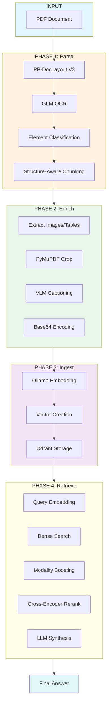

# Multimodal RAG Prototype

A structure-aware multimodal retrieval-augmented generation (RAG) pipeline that preserves document layout, tables, images, and formulas for improved retrieval quality over naive text extraction approaches.

## Overview

This prototype demonstrates how preserving document structure (element types, bounding boxes, reading order) dramatically improves retrieval quality compared to naive text chunking. The pipeline:

1. **Parses** PDFs with structure awareness (tables, images, formulas preserved)
2. **Enriches** with VLM-generated image captions
3. **Ingests** into a vector database (Qdrant)
4. **Retrieves** with modality boosting + cross-encoder reranking



---

## Features

### 1. Structure-Aware Parsing
- Uses **PP-DocLayout-V3** for layout detection (tables, figures, formulas, text)
- Uses **GLM-OCR** for text recognition within detected regions
- Preserves bounding boxes for spatial-aware retrieval

### 2. Multimodal Enrichment
- Extracts images/tables/formulas as base64-encoded images
- Generates descriptive captions via VLM (qwen2.5vl:7b)
- Stores both raw content and captions for semantic search

### 3. Modality Boosting
- Automatically detects visual queries (keywords: diagram, flowchart, figure, image...)
- Applies 35% score boost to image chunks for visual queries
- Ensures images rank #1 for diagram-related questions

### 4. Cross-Encoder Reranking
- Two-stage retrieval: dense search → cross-encoder reranking
- Uses ms-marco-MiniLM-L-12-v2 for relevance scoring
- Improves precision from top-20 to top-4
- **Note**: Skipped for visual queries (modality boosting alone works better)

### 5. Local-First Architecture
- All models run locally via Ollama
- No external API dependencies
- Qdrant for local vector storage

---

## System Components

### Pipeline Components

| Component | File | Description |
|----------|------|-------------|
| PDF Parser | `phase1_parse.py` | Extracts structure using PP-DocLayout + GLM-OCR |
| Enricher | `phase2_enrich.py` | Generates VLM captions for images |
| Ingestor | `phase3_ingest.py` | Embeds chunks to Qdrant |
| Retriever | `phase4_retrieve.py` | Query with dense + reranking |
| Test Runner | `run_test_queries.py` | Runs standard test queries |
| All-in-One | `run_all.py` | Runs full pipeline |

### Models

| Model | Type | Purpose |
|-------|------|---------|
| qwen3-embedding:4b | Embedding | Vector search (2560-dim) |
| qwen2.5vl:7b | LLM + VLM | Answer generation + image captions |
| ms-marco-MiniLM-L-12-v2 | Cross-Encoder | Relevance reranking |
| PP-DocLayout-V3 | Layout Detection | Document structure detection |
| GLM-OCR | OCR | Text recognition |

### Data Schemas

| Schema | File | Fields |
|--------|------|---------|
| ParsedElement | `schemas.py` | label, text, bbox, score, reading_order |
| Chunk | `schemas.py` | text, chunk_id, page, modality, image_base64, caption |

---

## Installation & Setup

### Prerequisites

1. **Ollama** - Run `ollama serve` before starting
2. **uv** - Package manager (install via `pip install uv`)
3. **Python 3.12** - Required for cross-encoder support (numpy compatibility)

### Model Setup

```bash
# Pull required models
ollama pull qwen3-embedding:4b   # Embeddings
ollama pull qwen2.5vl:7b       # LLM + VLM
```

### Install Dependencies

```bash
cd article_prototype

# Install Python 3.12 via uv
uv python install 3.12

# Create virtual environment
rm -rf .venv
uv venv .venv --python 3.12

# Activate and install dependencies
source .venv/bin/activate
uv sync
```

### Directory Structure

```
article_prototype/
├── config.yaml              # Single source of truth for models
├── phase1_parse.py       # PDF parsing (PP-DocLayout + GLM-OCR)
├── phase2_enrich.py      # VLM image captioning
├── phase3_ingest.py     # Qdrant vector ingestion
├── phase4_retrieve.py  # Retrieval + synthesis
├── run_all.py           # Run full pipeline
├── run_test_queries.py # Run test queries
├── schemas.py           # Data models
├── chunker.py           # Chunking logic
├── qdrant_db/          # Local vector database
└── output/              # Intermediate files
    ├── structured_chunks.json
    └── enriched_chunks.json
```

---

## Configuration

All models are configured in `config.yaml`:

```yaml
models:
  # Embedding model for vector search
  embedding: "qwen3-embedding:4b"
  
  # Language model for answer generation
  llm: "qwen2.5vl:7b"
  
  # Vision Language Model for image captioning
  vlm: "qwen2.5vl:7b"
  
  # Cross-encoder for reranking
  cross_encoder: "cross-encoder/ms-marco-MiniLM-L-12-v2"
```

---

## Usage

### Option 1: Run All-in-One Script (Recommended)

```bash
# Full pipeline + test queries
python run_all.py

# Just test queries (if data already exists)
python run_all.py --test-only

# Interactive retrieval mode
python phase4_retrieve.py
```

### Option 2: Run Individual Phases

#### Phase 1: Parse PDF (Real Engine)

```bash
python phase1_parse.py test.pdf --engine real
```

Outputs:
- `output/naive_chunks.json` - Baseline (flat text)
- `output/structured_chunks.json` - Structure-aware

#### Phase 2: Enrich

```bash
python phase2_enrich.py
```

Adds base64 images and VLM captions to chunks.

#### Phase 3: Ingest to Qdrant

```bash
python phase3_ingest.py
```

Embeds chunks and stores in Qdrant.

#### Phase 4: Interactive Retrieval

```bash
python phase4_retrieve.py
```

Then enter queries interactively.

---

## Modality Boosting

### The Problem

Visual queries like "What does the architecture diagram show?" didn't retrieve image chunks because:

1. Image captions use "transformer model" not "diagram"
2. Text chunks about encoder/decoder score marginally higher
3. Images ranked #7+ despite being highly relevant

### The Solution

**Query-time modality boosting** in `phase4_retrieve.py`:

```python
visual_keywords = {"diagram", "flowchart", "figure", "image", 
                 "chart", "visual", "illustration", "picture",
                 "encoder", "decoder"}

if set(query.lower().split()) & visual_keywords:
    # 35% boost for image chunks
    for hit in results:
        if hit.payload.get("modality") == "image":
            hit.score *= 1.35
```

### Results

| Query | Before | After (Boosted) |
|-------|--------|----------------|
| "What does the architecture diagram show?" | IMAGE #7 (0.837) | **IMAGE #1 (1.133)** |
| "Describe encoder/decoder in flowchart" | IMAGE #12 (0.665) | **IMAGE #1 (0.897)** |

---

## Test Results

See [TEST_RESULTS.md](TEST_RESULTS.md) for detailed query results.

| Query Type | Top Result | Status |
|-----------|----------|--------|
| Table | TABLE at #1 | ✅ |
| Image | IMAGE at #1 (with boost) | ✅ |
| Text | TEXT at #1 | ✅ |

---

## Pipeline Details

For detailed workflow diagrams, see [workflow.md](workflow.md):

- Overall pipeline flow
- Phase 1-4 detailed diagrams
- Modality boosting logic flowchart
- Data schemas

---

## API Reference

### Key Functions

#### phase4_retrieve.py

```python
def embed_text(text: str) -> list[float]:
    """Generate embedding using config embedding model"""
    
def generate_answer(query: str, contexts: list[dict]) -> str:
    """Synthesize answer from retrieved contexts"""
```

#### phase3_ingest.py

```python
def embed_text(client: OpenAI, text: str) -> list[float]:
    """Generate embedding vector"""
```

#### phase2_enrich.py

```python
def caption_image(base64_img: str) -> str:
    """Generate VLM caption for image"""
```

### Schemas

```python
@dataclass
class Chunk:
    text: str                    # Text content
    chunk_id: str               # Unique ID
    page: int                # Page number
    modality: str            # image/table/formula/text
    image_base64: str       # Optional base64
    caption: str          # Optional VLM caption
```

---

## Troubleshooting

### Model Not Found

```bash
# Pull models first
ollama pull qwen3-embedding:4b
ollama pull qwen2.5vl:7b
```

### Qdrant Lock Error

```bash
# Delete lock file
rm qdrant_db/.lock
```

### Cross-Encoder Import Error

If you see numpy type errors, ensure you're using Python 3.12:
```bash
uv python install 3.12
uv venv .venv --python 3.12
source .venv/bin/activate
uv sync
```

---

## License

MIT License
