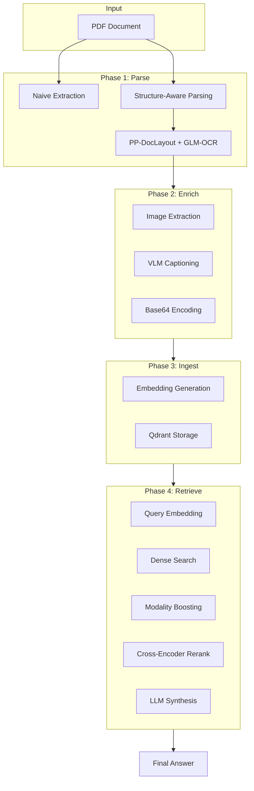
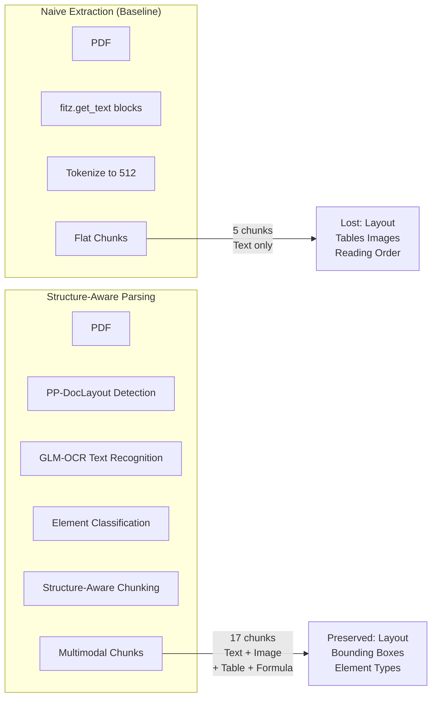
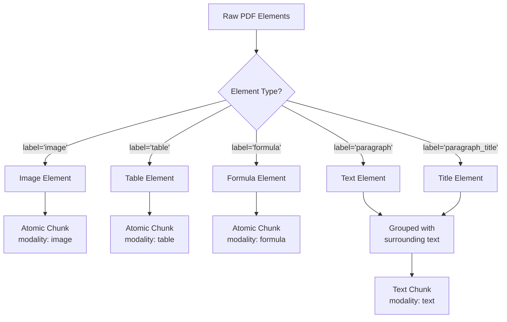
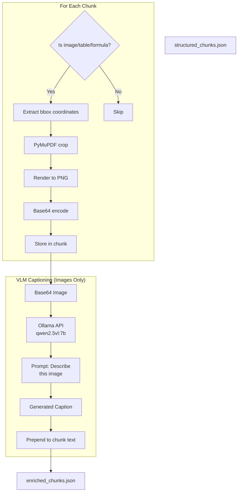
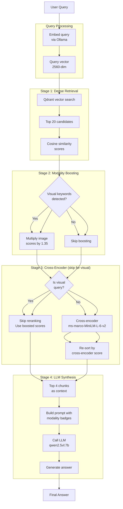
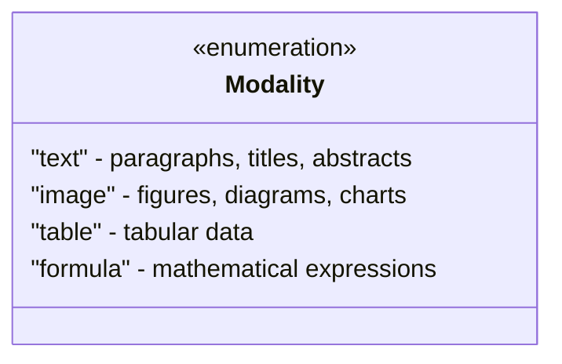

# Multimodal RAG Pipeline: Technical Workflows

This document provides detailed workflow diagrams for each phase of the Multimodal RAG pipeline.

---

## 1. Overall Pipeline



---

## 2. Phase 1: Document Parsing

### 2.1 Naive vs Structure-Aware Comparison



### 2.2 Parsing Element Classification



---

## 3. Phase 2: Multimodal Enrichment



### 3.1 Chunk Schema After Enrichment

```mermaid
classDiagram
    class Chunk {
        +string text
        +string chunk_id
        +int page
        +list element_types
        +list bbox
        +string source_file
        +bool is_atomic
        +string modality
        +string image_base64
        +string caption
    }
    
    Chunk : "text": "[IMAGE CAPTION] The transformer architecture shows encoder and decoder blocks...\n\n[ORIGINAL TEXT] The image is a flowchart..."
    Chunk : "modality": "image" | "table" | "formula" | "text"
    Chunk : "image_base64": "iVBORw0KGgoAAA..."
```

---

## 4. Phase 3: Vector Ingestion

```mermaid
flowchart TB
    Input[enriched_chunks.json]
    
    subgraph Embed["Embedding Pipeline"]
        E1[Initialize Ollama Client]
        E2[Test embedding<br/>dimension]
        E3[Create Qdrant collection<br/>Cosine distance]
    end
    
    subgraph Process["For Each Chunk"]
        P1[Extract text field]
        P2[Call Ollama<br/>embeddings API]
        P3[Get vector<br/>2560-dim (qwen3)]
        P4[Build metadata<br/>chunk_id, page, modality]
    end
    
    subgraph Store["Qdrant Upsert"]
        S1[Create PointStruct]
        S2[Add vector]
        S3[Add payload<br/>text + metadata]
        S4[Upsert to collection]
    end
    
    Input --> E1
    E1 --> E2
    E2 --> E3
    E3 --> Process
    Process --> P1
    P1 --> P2
    P2 --> P3
    P3 --> P4
    P4 --> Store
    Store --> Output[Qdrant Collection<br/>article_chunks]
```

---

## 5. Phase 4: Retrieval & Synthesis

### 5.1 Complete Query Flow



### 5.2 Modality Boosting Logic

```mermaid
flowchart TB
    Start[Incoming Query] --> Extract{Extract query words}
    
    Extract --> Lower[Convert to lowercase]
    Lower --> Split[Split by whitespace]
    Split --> Keywords{Contains visual<br/>keywords?}
    
    Keywords -->|"Yes"| Visual[Visual Query<br/>Detected]
    Keywords -->|"No"| NonVisual[Non-Visual Query]
    
    Visual --> ForEach[For each result]
    ForEach --> CheckMod{modality<br/>== "image"?}
    
    CheckMod -->|Yes| Boost[score = score × 1.35]
    CheckMod -->|No| NoBoost[No change]
    
    Boost --> AllDone[All results processed]
    NoBoost --> AllDone
    NonVisual --> Skip[Skip boosting<br/>Use original scores]
    
    AllDone --> Sort[Sort by<br/>adjusted score]
    Skip --> Sort
    
    Sort --> Output[Ranked results]
    
    note1[("Visual Keywords:<br/>diagram, flowchart,<br/>figure, image, chart,<br/>visual, illustration,<br/>picture, encoder,<br/>decoder")]
    Keywords -.-> note1
```

### 5.3 Why Modality Boosting?

```mermaid
flowchart LR
    subgraph Problem["Before Boosting"]
        P1[Query: "What does the<br/>architecture diagram show?"]
        P2[Top Results:<br/>1. test.pdf_1_2 TEXT 0.852<br/>2. test.pdf_3_1 TABLE 0.847<br/>3. test.pdf_3_2 TEXT 0.847<br/>...<br/>7. test.pdf_1_0 IMAGE 0.837]
        P3[Problem: IMAGE at #7<br/>despite query about diagram]
    end
    
    subgraph Solution["After Boosting"]
        S1[Query: "What does the<br/>architecture diagram show?"]
        S2[Visual keyword<br/>"diagram" detected]
        S3[IMAGE score: 0.837 × 1.35<br/>= 1.130]
        S4[Top Results:<br/>1. test.pdf_1_0 IMAGE 1.130<br/>2. test.pdf_1_2 TEXT 0.852<br/>3. test.pdf_3_1 TABLE 0.847<br/>4. test.pdf_3_2 TEXT 0.847]
    end
    
    P1 --> P2 --> P3
    S1 --> S2 --> S3 --> S4
```

---

## 6. Data Schemas

### 6.1 Chunk Metadata Fields

| Field | Type | Description | Example |
|-------|------|-------------|---------|
| `chunk_id` | string | Unique identifier | `test.pdf_1_0` |
| `page` | int | Page number | `1` |
| `modality` | string | Element type | `image`, `table`, `formula`, `text` |
| `source_file` | string | Original PDF | `test.pdf` |
| `element_types` | list | Element labels | `["figure_title", "image"]` |
| `bbox` | list | Bounding box | `[100, 380, 500, 580]` |
| `is_atomic` | bool | Single element? | `true` for tables/images |
| `image_base64` | string | PNG in base64 | `iVBORw0KGgo...` |
| `caption` | string | VLM-generated | `The transformer architecture...` |

### 6.2 Supported Modalities



---

## 7. Configuration Reference

### 7.1 Model Configuration

```yaml
models:
  embedding: "qwen3-embedding:4b"  # Vector embeddings
  llm: "qwen2.5vl:7b"              # Answer generation
  vlm: "qwen2.5vl:7b"              # Image captioning
  cross_encoder: "cross-encoder/ms-marco-MiniLM-L-12-v2"  # Re-ranking
```

### 7.2 Pipeline Configuration

```yaml
pipeline:
  ocr_api:
    model: glm-ocr:latest    # Layout detection
    api_mode: openai         # Ollama OpenAI-compatible API
  layout:
    enable_layout: true      # PP-DocLayout-V3
```

---

## 8. Error Handling

### 8.1 Common Issues

| Issue | Cause | Solution |
|-------|-------|----------|
| Empty embeddings | Ollama not running | Start `ollama serve` |
| Qdrant lock error | DB in use | Delete `.lock` file |
| VLM timeout | Large images | Reduce DPI or image size |
| Cross-encoder import | Python 3.9 numpy bug | Use Python 3.10+ or skip reranking |

---

## 9. Performance Characteristics

| Stage | Time | Notes |
|-------|------|-------|
| Phase 1 (Parse) | ~5s/page | Depends on PDF complexity |
| Phase 2 (Enrich) | ~10s/image | VLM inference time |
| Phase 3 (Ingest) | ~100ms/chunk | Embedding + upsert |
| Phase 4 (Query) | ~500ms | Embed + search + rerank + LLM |

---

*For more details on the overall project, see [README.md](README.md)*
