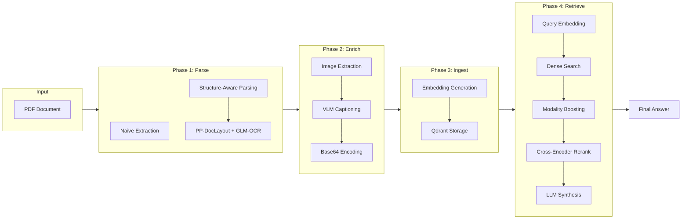
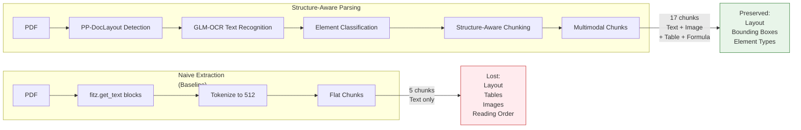
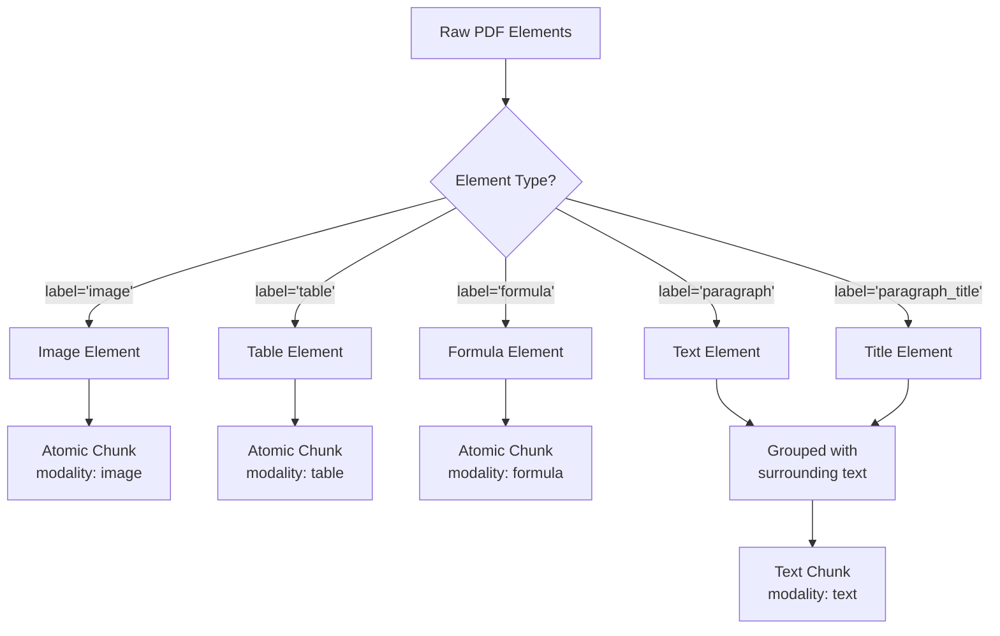
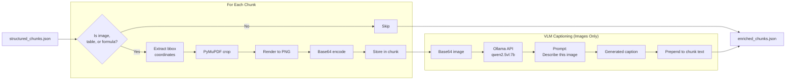
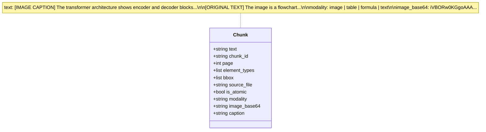
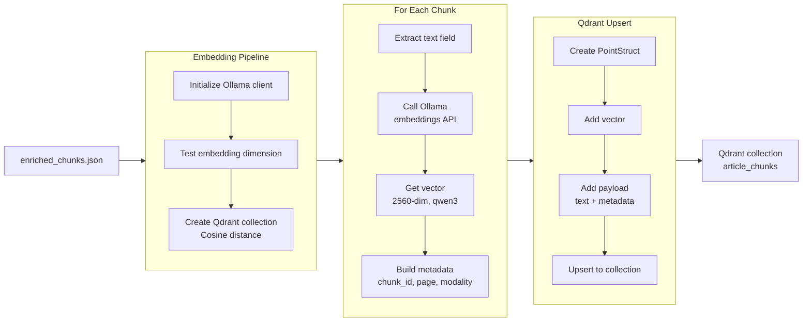
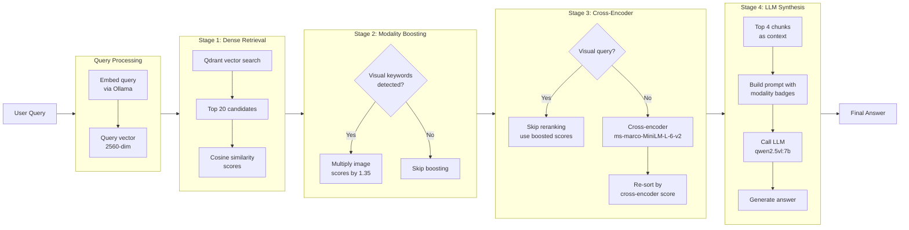
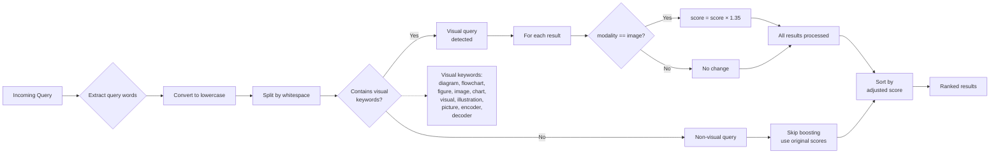
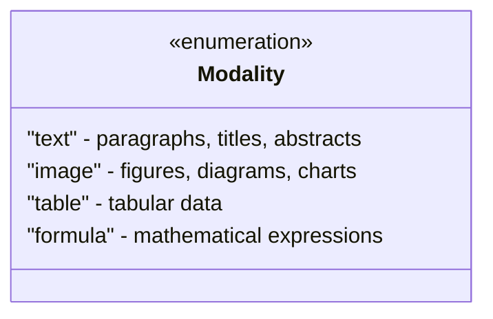

# Multimodal RAG Pipeline: Technical Workflows

This document provides detailed workflow diagrams for each phase of the Multimodal RAG pipeline.

---

## 1. Overall Pipeline



---

## 2. Phase 1: Document Parsing

### 2.1 Naive vs Structure-Aware Comparison



### 2.2 Parsing Element Classification



---

## 3. Phase 2: Multimodal Enrichment



### 3.1 Chunk Schema After Enrichment



---

## 4. Phase 3: Vector Ingestion



---

## 5. Phase 4: Retrieval & Synthesis

### 5.1 Complete Query Flow



### 5.2 Modality Boosting Logic



### 5.3 Visual Query Detection & Boosting

```mermaid
flowchart TD
    Q[Query] --> Token[Tokenize + lowercase]
    Token --> KW{Any keyword matches<br/>visual_keywords?}

    KW -->|Yes| Visual[Visual Query Detected]
    Visual --> Boost[For each result<br/>modality == image?<br/>score = score × 1.35]
    Boost --> Skip[Skip cross-encoder<br/>use boosted scores]
    Skip --> Top4[Select top 4]

    KW -->|No| NonVisual[Non-Visual Query]
    NonVisual --> Rerank[Cross-encoder rerank<br/>ms-marco-MiniLM-L-6-v2]
    Rerank --> Sort[Sort by rerank score]
    Sort --> Top4

    KW -.-- Note[visual_keywords:<br/>diagram, flowchart,<br/>figure, image, chart,<br/>visual, illustration,<br/>picture, encoder,<br/>decoder]

    Note -.-> Visual
```

**Why It Works:**

| Scenario | Query Type | Behavior |
|----------|------------|----------|
| "How does the **encoder** work?" | Visual | Boost image scores ×1.35, skip cross-encoder |
| "What are the **results** in Table 2?" | Non-Visual | Use cross-encoder reranking |
| "Explain the **flowchart**" | Visual | Boost image scores ×1.35, skip cross-encoder |

**Score Example:**
```
Query: "diagram of transformer"
Initial: IMAGE #7, score 0.837 (ranked 7th)
After boost: 0.837 × 1.35 = 1.130 → moves to #1
```

---

## 6. Data Schemas

### 6.1 Chunk Metadata Fields

| Field | Type | Description | Example |
|-------|------|-------------|---------|
| `chunk_id` | string | Unique identifier | `test.pdf_1_0` |
| `page` | int | Page number | `1` |
| `modality` | string | Element type | `image`, `table`, `formula`, `text` |
| `source_file` | string | Original PDF | `test.pdf` |
| `element_types` | list | Element labels | `["figure_title", "image"]` |
| `bbox` | list | Bounding box | `[100, 380, 500, 580]` |
| `is_atomic` | bool | Single element? | `true` for tables/images |
| `image_base64` | string | PNG in base64 | `iVBORw0KGgo...` |
| `caption` | string | VLM-generated | `The transformer architecture...` |

### 6.2 Supported Modalities



---

## 7. Configuration Reference

### 7.1 Model Configuration

```yaml
models:
  embedding: "qwen3-embedding:4b"  # Vector embeddings
  llm: "qwen2.5vl:7b"              # Answer generation
  vlm: "qwen2.5vl:7b"              # Image captioning
  cross_encoder: "cross-encoder/ms-marco-MiniLM-L-12-v2"  # Re-ranking
```

### 7.2 Pipeline Configuration

```yaml
pipeline:
  ocr_api:
    model: glm-ocr:latest    # Layout detection
    api_mode: openai         # Ollama OpenAI-compatible API
  layout:
    enable_layout: true      # PP-DocLayout-V3
```

---

## 8. Error Handling

### 8.1 Common Issues

| Issue | Cause | Solution |
|-------|-------|----------|
| Empty embeddings | Ollama not running | Start `ollama serve` |
| Qdrant lock error | DB in use | Delete `.lock` file |
| VLM timeout | Large images | Reduce DPI or image size |
| Cross-encoder import | Python 3.9 numpy bug | Use Python 3.10+ or skip reranking |

---

## 9. Performance Characteristics

| Stage | Time | Notes |
|-------|------|-------|
| Phase 1 (Parse) | ~5s/page | Depends on PDF complexity |
| Phase 2 (Enrich) | ~10s/image | VLM inference time |
| Phase 3 (Ingest) | ~100ms/chunk | Embedding + upsert |
| Phase 4 (Query) | ~500ms | Embed + search + rerank + LLM |

---

*For more details on the overall project, see [README.md](README.md)*
